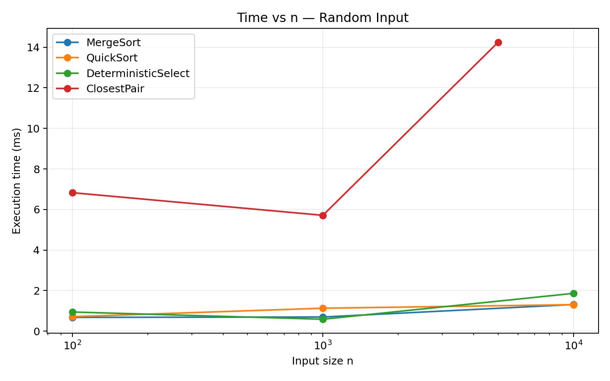
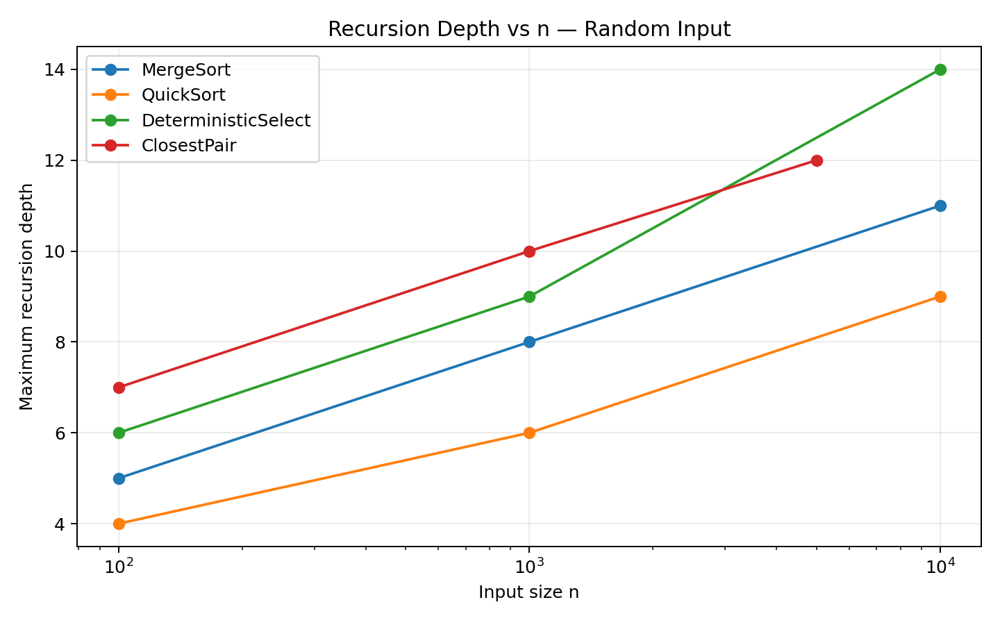
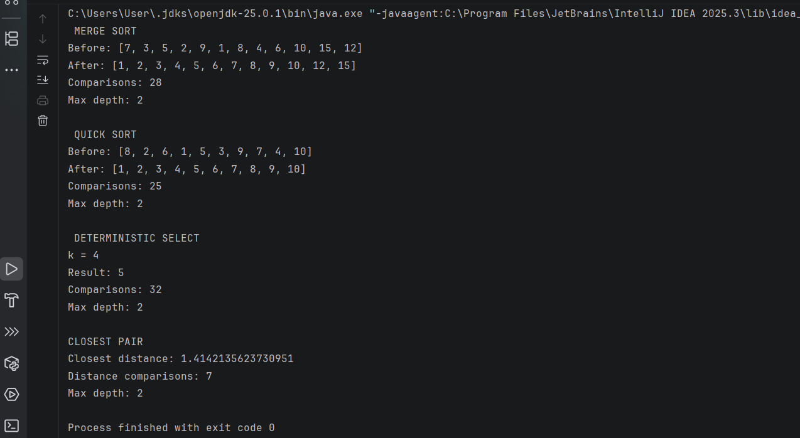
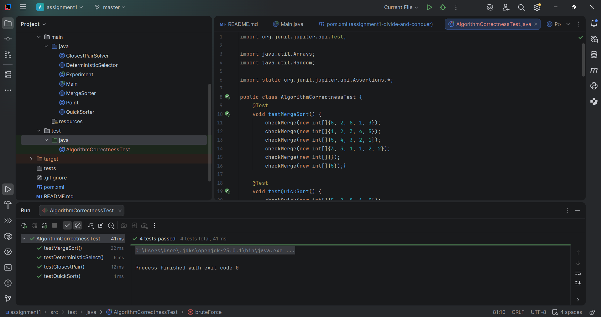
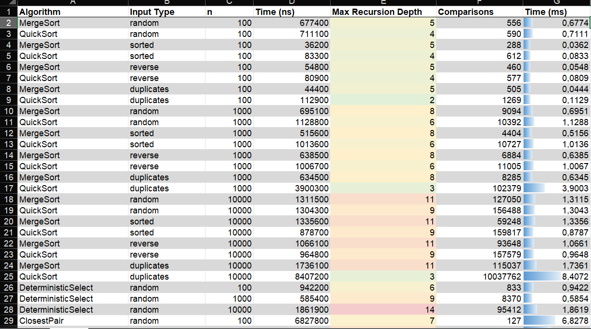

# Assignment 1: Divide-and-Conquer Algorithm Analysis

## A. Project Overview

The purpose of this assignment is to implement and analyze classic divide-and-conquer algorithms in Java. The project compares theoretical complexity with practical measurements such as execution time, maximum recursion depth, and number of comparisons.

The project implements four algorithms:

1. **MergeSort**
2. **Randomized QuickSort**
3. **Deterministic Select (Median-of-Medians)**
4. **Closest Pair of Points**

The program also contains automated correctness tests and an experiment runner that saves results to CSV.

### Project Structure

```text
assignment1/
├── src/
│   ├── main/
│   │   └── java/
│   │       ├── MergeSorter.java
│   │       ├── QuickSorter.java
│   │       ├── DeterministicSelector.java
│   │       ├── ClosestPairSolver.java
│   │       ├── Experiment.java
│   │       ├── Point.java
│   │       └── Main.java
│   └── test/
│       └── java/
│           └── AlgorithmCorrectnessTest.java
├── docs/
│   ├── screenshots/
│   └── plots/
├── results/
│   └── results.csv
├── README.md
├── pom.xml
└── .gitignore
```

---

## B. Algorithm Analysis

### 1. MergeSort

#### How it works

MergeSort divides the array into two halves, recursively sorts both halves, and then merges the two sorted parts.

This implementation also uses:

- one reusable auxiliary buffer;
- a small-input cutoff;
- Insertion Sort when the current part has 10 or fewer elements.

#### Time Complexity

The main recurrence is:

```text
T(n) = 2T(n/2) + Θ(n)
```

There are two recursive subproblems of size `n/2`, and merging requires linear work.

Using the Master Theorem:

```text
a = 2
b = 2
f(n) = Θ(n)

n^(log_b(a)) = n
```

Therefore:

```text
T(n) = Θ(n log n)
```

#### Space Complexity

The reusable buffer requires `O(n)` extra space. The recursion stack requires `O(log n)` space, so the total auxiliary space is `O(n)`.

---

### 2. Randomized QuickSort

#### How it works

QuickSort chooses a random pivot and partitions the array in place. Elements smaller than the pivot are moved to the left side and larger or equal elements remain on the right side.

To control recursion depth, the algorithm recursively processes only the smaller partition. The larger partition is processed by the `while` loop.

#### Time Complexity

For a reasonably balanced partition:

```text
T(n) = 2T(n/2) + Θ(n)
```

This gives:

```text
Θ(n log n)
```

The general recurrence is:

```text
T(n) = T(k) + T(n-k-1) + Θ(n)
```

In the worst case, one side contains almost all elements:

```text
T(n) = T(n-1) + Θ(n)
```

Therefore the worst-case time complexity is:

```text
O(n²)
```

#### Space Complexity

Partitioning is in place and needs only constant extra array space. Because the implementation recursively processes the smaller partition, the recursion stack is typically `O(log n)`.

---

### 3. Deterministic Select (Median-of-Medians)

#### How it works

The algorithm finds the element at index `k` without fully sorting the array.

The implementation:

1. divides the elements into groups of 5;
2. sorts each small group;
3. finds the median of every group;
4. finds the median of these medians;
5. uses it as the pivot;
6. partitions the array in place;
7. recursively continues only in the partition that contains `k`.

#### Time Complexity

The standard recurrence can be written as:

```text
T(n) ≤ T(n/5) + T(7n/10) + Θ(n)
```

The median-of-medians pivot guarantees that a constant fraction of elements is discarded at each level.

Using Akra-Bazzi intuition / the standard Median-of-Medians analysis:

```text
T(n) = Θ(n)
```

So the worst-case running time is linear.

#### Space Complexity

The partitioning is in place. The main additional space comes from recursion, which is `O(log n)` in this implementation.

---

### 4. Closest Pair of Points

#### How it works

The algorithm finds the minimum Euclidean distance between two points.

The implementation:

1. sorts points by x-coordinate;
2. also keeps points ordered by y-coordinate;
3. divides the points into left and right halves;
4. recursively finds the best distance in both halves;
5. creates a vertical strip around the middle line;
6. checks only relevant points in the strip in y-order.

For very small subproblems, a brute-force method is used.

#### Time Complexity

After sorting, the recursive part follows:

```text
T(n) = 2T(n/2) + Θ(n)
```

Using the Master Theorem:

```text
T(n) = Θ(n log n)
```

Initial sorting also takes `O(n log n)`, so the total complexity remains:

```text
Θ(n log n)
```

#### Space Complexity

The implementation creates temporary point arrays and sets while dividing the data. The peak additional memory is `O(n)`.

---

## C. Experimental Results

The experiments were executed with `System.nanoTime()`.

Measured metrics:

- execution time;
- maximum recursion depth;
- number of comparisons / distance checks.

### Input Sizes

For MergeSort, QuickSort, and Deterministic Select:

```text
100
1,000
10,000
```

For Closest Pair:

```text
100
1,000
5,000
```

Sorting algorithms were tested with:

- random input;
- sorted input;
- reverse-sorted input;
- duplicate-heavy input.

The complete experimental data is available in:

- [`results/results.csv`](results/results.csv)
- [`docs/plots/DAA_Assignment1_Results.xlsx`](docs/plots/DAA_Assignment1_Results.xlsx)

### Execution Time — Random Input

Time is shown in milliseconds.

| n | MergeSort | QuickSort | Deterministic Select |
|---:|---:|---:|---:|
| 100 | 0.6774 | 0.7111 | 0.9422 |
| 1,000 | 0.6951 | 1.1288 | 0.5854 |
| 10,000 | 1.3115 | 1.3043 | 1.8619 |

### Closest Pair Execution Time

| n | Time (ms) |
|---:|---:|
| 100 | 6.8278 |
| 1,000 | 5.7114 |
| 5,000 | 14.2457 |

### Maximum Recursion Depth — Random Input

| n | MergeSort | QuickSort | Deterministic Select |
|---:|---:|---:|---:|
| 100 | 5 | 4 | 6 |
| 1,000 | 8 | 6 | 9 |
| 10,000 | 11 | 9 | 14 |

### Closest Pair Recursion Depth

| n | Maximum Depth |
|---:|---:|
| 100 | 7 |
| 1,000 | 10 |
| 5,000 | 12 |

### Effect of Input Type at n = 10,000

| Input Type | MergeSort Time (ms) | QuickSort Time (ms) |
|---|---:|---:|
| Random | 1.3115 | 1.3043 |
| Sorted | 1.3356 | 0.8787 |
| Reverse-sorted | 1.0661 | 0.9648 |
| Duplicate-heavy | 1.7361 | 8.4072 |

### Additional Metric: Comparisons

At `n = 10,000`:

| Input Type | MergeSort Comparisons | QuickSort Comparisons |
|---|---:|---:|
| Random | 127,050 | 156,488 |
| Sorted | 59,248 | 159,817 |
| Reverse-sorted | 93,648 | 157,579 |
| Duplicate-heavy | 115,037 | 10,037,762 |

Deterministic Select used **95,412 comparisons** for random `n = 10,000`.

Closest Pair performed **6,444 distance checks** for random `n = 5,000`.

### Plots

#### Time vs. n



#### Recursion Depth vs. n



---

## D. Discussion

### 1. Do the results match theoretical complexity?

In general, the results follow the expected theoretical trends.

MergeSort and QuickSort remain fast as the input size grows from 100 to 10,000. Their expected practical behavior is close to `n log n`.

Deterministic Select also remains efficient as the input grows, which agrees with its theoretical `Θ(n)` worst-case complexity.

Closest Pair scales much better than checking every possible pair for large datasets, which is consistent with its `Θ(n log n)` complexity.

The measured times are not perfectly monotonic. For example, some runs with `n = 1,000` are faster than runs with `n = 100`. This is normal for short JVM benchmarks because startup, JIT compilation, caching, and operating-system activity can affect individual measurements.

### 2. How does input structure affect performance?

MergeSort is relatively stable because it always divides the array into two halves and performs a merge.

QuickSort is more sensitive to partition structure. Random pivots reduce the probability of consistently poor partitions for sorted and reverse-sorted inputs.

The duplicate-heavy input had the largest effect on the current QuickSort implementation. At `n = 10,000`, QuickSort required **10,037,762 comparisons** and **8.4072 ms**, much more than for the other input types. This happens because the partition condition uses `< pivot`, so values equal to the pivot are not separated into their own partition.

### 3. Why does smaller-first recursion help QuickSort?

After partitioning, the implementation compares the sizes of the left and right partitions.

The smaller partition is processed recursively, while the larger partition is handled by the loop.

This limits the number of recursive calls stored on the call stack. Even if the partitions are unbalanced, recursion is used for the smaller side, helping keep stack depth around `O(log n)`.

### 4. Why does Median-of-Medians guarantee O(n)?

Median-of-Medians divides the array into groups of 5 and uses the median values to construct a reliable pivot.

This pivot cannot repeatedly be an extremely bad pivot. A constant fraction of the elements is guaranteed to be discarded after partitioning.

Therefore, the total amount of work across recursive levels remains linear, giving a worst-case complexity of `Θ(n)`.

### 5. Why is divide-and-conquer Closest Pair faster than O(n²) for large inputs?

A brute-force solution compares every possible pair of points, so its complexity is `O(n²)`.

The divide-and-conquer method splits the points into two halves and recursively solves each half. After that, it checks only a narrow strip around the dividing line.

Because it avoids checking most point pairs, its complexity is `Θ(n log n)`, which grows much more slowly than `n²`.

### 6. What practical factors affect performance?

Practical execution time can be affected by:

- JVM startup and warm-up;
- JIT compilation;
- CPU cache behavior;
- garbage collection;
- memory allocation;
- background operating-system processes;
- random pivot selection;
- short benchmark duration.

For this reason, measured execution time may vary between runs even when the theoretical complexity does not change.

---

## E. Reflection

During this assignment, I learned how divide-and-conquer algorithms solve large problems by dividing them into smaller subproblems. I also learned how to connect Java implementations with theoretical recurrences. MergeSort and Closest Pair showed how the Master Theorem can be used for recurrences such as `T(n) = 2T(n/2) + Θ(n)`, while Median-of-Medians showed how a carefully selected pivot can guarantee linear worst-case performance.

The main implementation challenges were controlling recursion depth, correctly handling duplicate values, and collecting performance metrics without changing the main purpose of the algorithms. The experiments also showed me that theoretical complexity and measured execution time are related but not identical. JVM warm-up, cache behavior, and other system effects can influence short measurements.

---

## Testing

### MergeSort and QuickSort

Both sorting algorithms are checked against Java's:

```java
Arrays.sort()
```

The tests include:

- unsorted/random-like input;
- already sorted input;
- reverse-sorted input;
- duplicate values;
- empty array;
- single-element array.

### Deterministic Select

The implementation runs **100 random tests**.

For every test, the expected result is produced by sorting a copy of the array and checking:

```java
Arrays.sort(a);
a[k]
```

### Closest Pair

For small datasets, the divide-and-conquer result is compared with an `O(n²)` brute-force implementation.

---

## F. Screenshots

### Program Output

Add the IntelliJ console screenshot here:

```text
docs/screenshots/main-output.png
```



### Test Results

Add the screenshot showing all JUnit tests passing:

```text
docs/screenshots/tests.png
```



### Experimental Results / Excel Dashboard

Current Excel/results screenshot:



---

## Git Workflow

The project was developed incrementally using separate commits for the main stages:

```text
project structure
feat(mergesort): implement merge sort
feat(quicksort): implement randomized quicksort
feat(select): implement median of medians
feat(closest): implement closest pair
feat(metrics): add performance measurements
feat(experiment): add CSV performance experiments
feat(testing): add correctness tests
docs(report): add analysis and plots
```

This history shows the development process instead of submitting the whole project in one commit.

---

## How to Run

### Run the demonstration

Open:

```text
src/main/java/Main.java
```

and run `Main.main()` in IntelliJ IDEA.

### Run the experiments

Open:

```text
src/main/java/Experiment.java
```

and run `Experiment.main()`.

The program creates:

```text
results/results.csv
```

### Run the tests

Run:

```text
src/test/java/AlgorithmCorrectnessTest.java
```

or use Maven:

```bash
mvn test
```

---

## Version

Version 1.0
